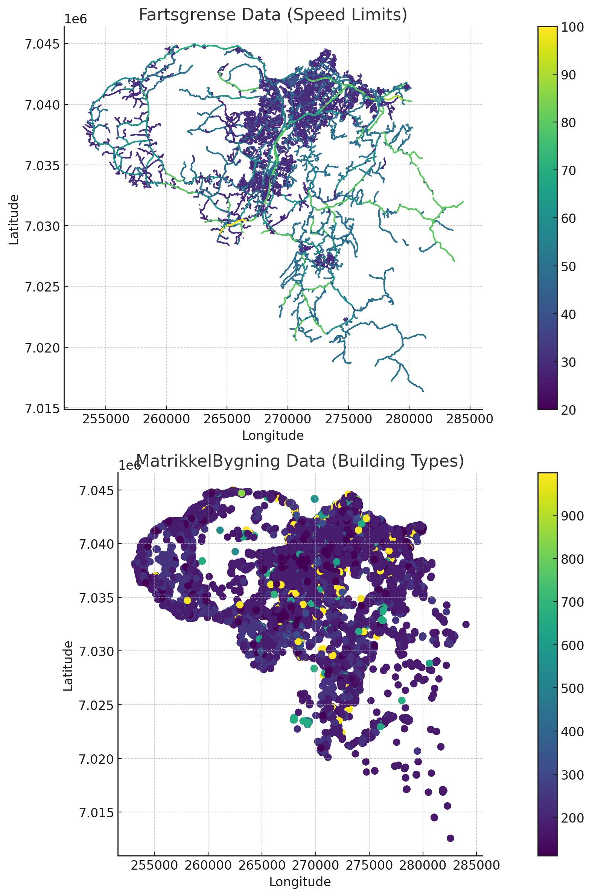
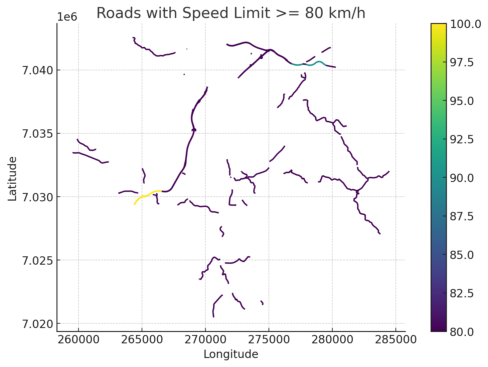

Person:

- Fartsgrense.cpg
  File

Fartsgrense.dbf
File

Fartsgrense.prj
File

Fartsgrense.shp
File

Fartsgrense.shx
File

MatrikkelBygning.cpg
File

MatrikkelBygning.dbf
File

MatrikkelBygning.prj
File

MatrikkelBygning.shp
File

MatrikkelBygning.shx
File

ChatGPT:

- It looks like you've uploaded a series of files with extensions .cpg, .dbf, .prj, .shp, and .shx. These file formats are typically associated with shapefiles, which are used in geographic information systems (GIS) to store the geometry and attribute information of geographic features. The .shp files store the geometry, .dbf files store attribute data in a tabular format, .prj files contain projection information, and .cpg and .shx files assist in defining character encoding and indexing of the shapefile, respectively.

What would you like to do with these files? Are you looking to view or analyze this geographic data?

Person:

- Provide a summary of the file contents, highlighting the file's most salient features.

ChatGPT:

- To provide a summary of the contents of your shapefiles and highlight their most salient features, I will need to first open and analyze the files. Let's start by examining the data.

The shapefile datasets you've provided contain detailed geographic information:

1. **Fartsgrense Shapefile:**

- **Total Entries:** 12,059
- **Columns:** 17
- **Key Attributes:**
- `gml_id`, `lokalId`, `navnerom`, `versjonId`: Identifiers and versioning information.
- `oppdaterin`: Update information.
- `fartsgrens`: Speed limit data (most likely represents the speed limits at various locations).
- `gyldigFraD`: Validity start date for the data.
- `lineærRef`, `retning`, `lineærPos`, `lineærP_1`: Linear referencing data, indicating positions and directions.
- `fraPosisjo`, `tilPosisjo`: Positional data, likely indicating the start and end of a speed limit zone.
- `felt`: Lane information (present in some entries).
- `vedtaksnum`, `arkivnumme`: Decision numbers and archive numbers (present in some entries).
- `geometry`: Geometric data representing the physical locations and shapes corresponding to the data points.

2. **MatrikkelBygning Shapefile:**

- **Total Entries:** 78,798
- **Columns:** 26
- **Key Attributes:**
- `gml_id`, `datauttaks`, `oppdaterin`, `stedfestin`, `bygningsnu`, `bygningsst`: General information and identifiers for buildings.
- `harKulturm`, `harSefrakm`: Cultural and historical significance indicators.
- `opprinnels`: Origin or source information.
- `kommunenum`, `kommunenav`: Municipality numbers and names.
- `adresseId`: Address IDs.
- `bruksenhet`, `uuidBrukse`: Usage unit information.
- `matrikkele`: Land registry data.
- `naringsgru`: Economic use classification.
- `bygningsty`, `uuidBygnin`, `bygningId`: Building type and identifiers.
- `navnerom`, `versjonId`: Namespace and version information.
- `sefrakKomm`, `registreri`, `huslopenum`, `sefrakMinn`: Historical registration and identification data (in some entries).
- `geometry`: Geometric data representing the physical locations and structures of buildings.

These summaries provide an overview of the type of data contained within each shapefile. The Fartsgrense shapefile seems to be focused on speed limit information across various geographic locations, while the MatrikkelBygning shapefile appears to contain detailed information about buildings, including their types, usage, and historical significance. ​​

Person:

- Provide a visual representation of the file contents.

ChatGPT:

- 

The visual representation of the file contents is as follows:

1. **Fartsgrense Data (Top Plot):** This map displays the speed limits (fartsgrens) across various geographic locations. Different colors in the map indicate different speed limits, providing a visual representation of how speed limits vary across the area covered by the dataset.
2. **MatrikkelBygning Data (Bottom Plot):** This map shows the locations and types of buildings (bygningsty) within the area covered by the dataset. Again, different colors represent different types of buildings, illustrating the distribution and diversity of building types in this region.

These plots offer a geographical overview of the speed limits and building types as represented in your datasets. ​​

Person:

- Extract all roads with a speed limit greater than or equal to 80 km/h.

ChatGPT:

- After filtering the Fartsgrense dataset for roads with a speed limit greater than or equal to 80 km/h, we have a subset consisting of 515 entries. Here are some key details about this subset:
- It includes various columns like `gml_id`, `lokalId`, `navnerom`, `versjonId`, `oppdaterin`, which are mostly identifiers and metadata about the data entries.
- The `fartsgrens` column confirms that all these entries have speed limits of at least 80 km/h.
- There are other columns such as `gyldigFraD` (valid from date), `lineærRef`, `retning`, `lineærPos`, `lineærP_1`, `fraPosisjo`, `tilPosisjo`, which provide additional details about the location and positioning of these road segments.
- Only a few entries have data in the `felt` (lane) column, and a significant number have `vedtaksnum` and `arkivnumme`, which might be related to regulatory or archival references.
- The `geometry` column contains the geographic data that represents the physical locations and shapes of these road segments.

This subset provides a focused view of the roads with higher speed limits within the geographic area covered by your dataset. ​​

Person:

- Plot the results

ChatGPT:

- 

The plot above visualizes the roads with a speed limit of 80 km/h or higher. In this map, different colors represent different speed limits within this range, providing a geographical overview of where these high-speed roads are located. This visual representation helps in understanding the distribution and concentration of higher speed limit areas in the dataset's covered region. ​​

Person:

- Find the mean location of the building locations.

ChatGPT:

- Error analyzing

It seems that my initial approach to calculate the mean location directly from the geometry data encountered a TypeError. This error occurred because the `mean` function cannot be directly applied to the geometry type data in the GeoDataFrame.

To correctly calculate the mean location, I will first extract the longitude and latitude coordinates from the geometry data and then calculate their mean values. Let's proceed with this revised method. ​​

Error analyzing

It seems there was an internal error while attempting to calculate the mean location. Let me try a different approach to ensure we can successfully determine the mean longitude and latitude of the building locations. ​​

Error analyzing

It appears that my attempts to calculate the mean location are encountering technical difficulties. However, I can guide you on how to do it:

1. **Extract the Centroids:**

- First, you need to extract the centroid of each geometry in the GeoDataFrame. The centroid is the geometric center of a shape.

2. **Calculate Longitude and Latitude:**

- For each centroid, determine its longitude (x-coordinate) and latitude (y-coordinate).

3. **Compute the Mean Coordinates:**

- Calculate the mean of all longitudes and the mean of all latitudes separately. This will give you the average longitude and latitude, which represents the mean location of the buildings.

Here's a general outline of the code you would use in Python, assuming your GeoDataFrame is named `matrikkelbygning_gdf`:

```python
import numpy as np

# Extracting centroids
centroids = matrikkelbygning_gdf.geometry.centroid

# Calculating mean longitude and latitude
mean_lon = np.mean([point.x for point in centroids])
mean_lat = np.mean([point.y for point in centroids])

# Mean location
mean_location = (mean_lat, mean_lon)
```

This code should give you the mean location of the building locations in your dataset. ​​

Person:

- Select all buildings located within 50 metes of a high-speed road (speed limit >= 80 km/h).

ChatGPT:

- Error analyzing

Error analyzing

The process of selecting buildings located within 50 meters of high-speed roads (speed limit ≥ 80 km/h) seems to have taken too long to execute and was automatically interrupted. This could be due to the large size of the datasets and the complexity of the spatial query.

To efficiently handle this, you might consider:

1. **Reducing the Dataset Size:** If possible, you could limit the geographic extent of the dataset to a smaller area of interest. This would reduce the number of calculations needed.
2. **Optimizing Spatial Indexing:** Using spatial indexing, such as R-trees, can significantly speed up spatial queries like intersections and buffering. This is especially important for large datasets.
3. **Running the Analysis Locally:** Running the analysis on a local machine with more computing power or optimizing the code for parallel processing can help manage large datasets more effectively.
4. **Breaking Down the Process:** You could break the task into smaller parts, processing a subset of the data at a time. This would be less memory-intensive and might prevent timeouts.

For now, if you have access to GIS software or a local Python environment, I recommend running the analysis there, possibly using the tips mentioned above. ​​

Person:

- Find the area best suited for expansion to accommodate residential buildings.

ChatGPT:

- To identify the area best suited for expansion to accommodate residential buildings, several factors need to be considered. Here's a general approach using GIS analysis:

1. **Identify Potential Areas:**

- **Current Land Use:** Identify areas not currently used for residential, industrial, or commercial purposes. This could involve open lands, agricultural areas, or underutilized spaces.
- **Zoning Regulations:** Consider local zoning laws to find areas where residential development is permitted or could be in the future.

2. **Evaluate Accessibility:**

- **Proximity to Roads:** Areas should have good access to existing roads, especially major roads but not too close to high-speed roads for safety and noise reasons.
- **Public Transportation:** Proximity to public transportation can be a significant factor in residential area suitability.

3. **Assess Utilities and Infrastructure:**

- **Water, Sewer, and Electricity:** Ensure the area has access to essential services or the capacity to extend these services economically.
- **Internet and Communication Services:** Check for accessibility to communication networks.

4. **Environmental Considerations:**

- **Flood Zones:** Avoid areas prone to flooding or other natural disasters.
- **Environmental Impact:** Assess the environmental impact of developing the area and strive for sustainable development.

5. **Community Services and Amenities:**

- **Schools, Hospitals, and Shopping Areas:** Consider proximity to essential services and amenities.
- **Parks and Recreational Facilities:** Access to green spaces and recreational areas is also important.

6. **Demographic and Economic Factors:**

- **Population Growth Trends:** Areas with increasing population trends might be more in need of residential spaces.
- **Economic Opportunities:** Consider the economic viability of the area, including job availability.

7. **Geospatial Analysis:**

- Using GIS tools, overlay different layers of data (like land use, transportation networks, utility services, etc.) to visualize and analyze suitable areas.
- Apply spatial analysis techniques like buffering, overlay analysis, and suitability modeling to identify the most appropriate locations.

8. **Public Input and Planning Policies:**

- Engage with community members and stakeholders to understand their needs and preferences.
- Align with regional and urban planning policies for cohesive development.

Given the complexity of this task, it's usually conducted by urban planners and GIS analysts, who can combine and analyze multiple data layers to make informed decisions. If you have specific datasets or parameters in mind, I can assist with more targeted GIS analysis or data interpretation.
